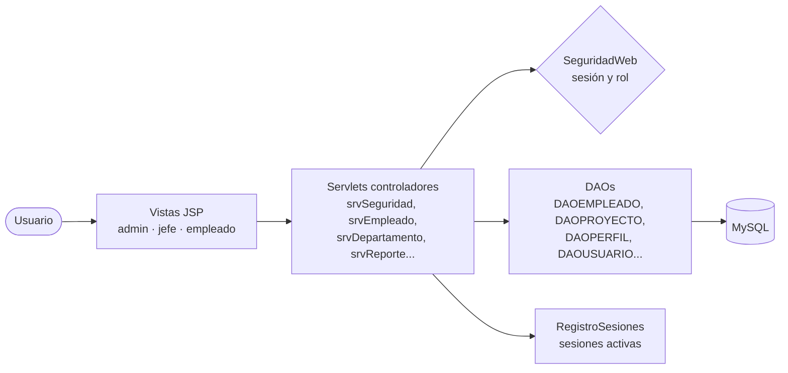

<div align="center">

# 🏢 Gestión de Proyectos Monster

### Sistema web de talento humano y proyectos con control de acceso por roles, construido de extremo a extremo: requisitos, UML, modelo de datos e implementación en Java EE

[](https://openjdk.org/)
[](https://jakarta.ee/)
[](https://jakarta.ee/specifications/pages/)
[](https://www.mysql.com/)
[](https://www.payara.fish/)
[](#-documentación-de-ingeniería)

</div>

---

## 📖 Descripción

**Gestión de Proyectos Monster** es un sistema para la empresa ficticia *Monster* que centraliza la información del personal (empleados, cargos, departamentos, formación académica, cargas familiares) y su asignación a proyectos, con un **módulo de seguridad** completo: usuarios, perfiles, opciones de menú por perfil y políticas de contraseña.

Lo que distingue a este proyecto es que recorre **todo el ciclo de ingeniería de software**: especificación de requisitos (ERS), especificación de casos de uso (ECUD), diagramas UML, modelo de datos conceptual → lógico → físico, scripts de base de datos, implementación y manual técnico.

## ✨ Funcionalidades

**Talento humano y proyectos**
- CRUD de empleados con datos personales, cargo, estado civil, formación académica y familiares.
- Gestión de departamentos y proyectos; asignación de empleados a proyectos con conteo de personal.
- **Organigrama** de la empresa generado desde la base de datos.
- **Reportes** de personal activo y roles listos para imprimir o exportar a PDF.

**Seguridad**
- Inicio de sesión con contraseñas cifradas mediante **SHA-256**.
- **Política de contraseñas**: más de 8 caracteres, al menos una mayúscula y un número; cambio de clave por el usuario y por el administrador.
- **Control de acceso por roles** (Administrador, Jefe, Empleado) con menús dinámicos según las opciones asignadas a cada perfil.
- **Registro global de sesiones activas**: cuando el administrador cambia el rol o el estado de un usuario, su sesión se actualiza o invalida en tiempo real, sin que tenga que volver a entrar.
- Filtro de codificación UTF-8 para toda la aplicación.

## 🏗️ Arquitectura

Patrón **MVC** con capa de acceso a datos mediante **DAO**:



```
src/java/ec/edu/monster/
├── controlador/   Servlets (seguridad, usuarios, perfiles, opciones, empleados,
│                  departamentos, organigrama, reportes), filtro UTF-8,
│                  SeguridadWeb y RegistroSesiones
└── modelo/        Entidades, DAOs, Conexion, Encriptador (SHA-256)
                   y PoliticaContrasena
web/
├── login.jsp, index.jsp, departamentos.jsp, usuarios.jsp
└── views/         admin/ (dashboard, perfiles, opciones, organigrama, reportes)
                   jefe/, empleado/, personal/
database/          Script completo, DDL, DML y migración
docs/              Requisitos, UML, modelo de datos y documentación
```

## 🗄️ Modelo de datos

18 tablas con nomenclatura estandarizada por módulo: **PE** (personal), **GE** (gestión de proyectos) y **XE** (seguridad).

```mermaid
erDiagram
    PEDEP_DEPAR ||--o{ GEPRO_PROYECT : "PEDEP_CODIGO"
    GEPRO_PROYECT ||--o{ GR_PEEMP_GEPRO : "GEPRO_CODIGO"
    PEEMP_EMPLE ||--o{ GR_PEEMP_GEPRO : "PEEMP_CODIGO"
    PEDEP_DEPAR ||--o{ PECAR_CARGO : "PEDEP_CODIGO"
    PEDEP_DEPAR ||--o{ PEEMP_EMPLE : "PEDEP_CODIGO"
    PEEMP_EMPLE ||--o{ PEEMP_EMPLE : "PEE_PEEMP_CODIGO"
    PEDEP_DEPAR ||--o{ PEEMP_EMPLE : "PED_PEDEP_CODIGO"
    PEDEP_DEPAR ||--o{ PEEMP_EMPLE : "PED_PEDEP_CODIGO2"
    PEEMP_EMPLE ||--o{ PEEMP_EMPLE : "PEE_PEEMP_CODIGO2"
    PESEX_SEXO ||--o{ PEEMP_EMPLE : "PESEX_CODIGO"
    PEESC_ESTCIV ||--o{ PEEMP_EMPLE : "PEESC_CODIGO"
    PEEMP_EMPLE ||--o{ PEFAM_FAMILI : "PEEMP_CODIGO"
    PEPRT_PARENT ||--o{ PEFAM_FAMILI : "PEPRT_CODIGO"
    PESEX_SEXO ||--o{ PEFAM_FAMILI : "PESEX_CODIGO"
    PEEMP_EMPLE ||--o{ PEEDU_EDUCACION : "PEEMP_CODIGO"
    PEEMP_EMPLE ||--o{ PEFIR_FIRMA : "PEEMP_CODIGO"
    XESIS_SISTE ||--o{ XEOPC_OPCIO : "XESIS_CODIGO"
    XEOPC_OPCIO ||--o{ XEOXP_OPCPE : "XEOPC_CODIGO"
    XEPER_PERFI ||--o{ XEOXP_OPCPE : "XEPER_CODIGO"
    PEEMP_EMPLE ||--o{ XEUSU_USUAR : "PEEMP_CODIGO"
    XEEST_ESTAD ||--o{ XEUSU_USUAR : "XEEST_CODIGO"
    XEPER_PERFI ||--o{ XEUXP_USUPE : "XEPER_CODIGO"
    PEDEP_DEPAR {
        key PRIMARY PK
        char PEDEP_CODIGO
        varchar PEDEP_DESCRI
    }
    GEPRO_PROYECT {
        char PEDEP_CODIGO FK
        key PRIMARY PK
        char GEPRO_CODIGO
    }
    GR_PEEMP_GEPRO {
        char PEEMP_CODIGO FK
        char GEPRO_CODIGO FK
        key PRIMARY PK
    }
    PECAR_CARGO {
        char PEDEP_CODIGO FK
        key PRIMARY PK
        char PECAR_CODIGOCARGO
    }
    PEEMP_EMPLE {
        char PEE_PEEMP_CODIGO FK
        char PEDEP_CODIGO FK
        char PEE_PEEMP_CODIGO2 FK
        char PESEX_CODIGO FK
        char PED_PEDEP_CODIGO FK
        char PEESC_CODIGO FK
        char PED_PEDEP_CODIGO2 FK
        key PRIMARY PK
    }
    PEEDU_EDUCACION {
        char PEEMP_CODIGO FK
        key PRIMARY PK
        char PEEDU_CODIGO
    }
    PEFIR_FIRMA {
        char PEEMP_CODIGO FK
        key PRIMARY PK
        char PEFIR_CODIGO
    }
    PEESC_ESTCIV {
        key PRIMARY PK
        char PEESC_CODIGO
        varchar PEESC_DESCRI
    }
    PEFAM_FAMILI {
        char PEEMP_CODIGO FK
        char PEPRT_CODIGO FK
        char PESEX_CODIGO FK
        key PRIMARY PK
    }
    PEPRT_PARENT {
        key PRIMARY PK
        char PEPRT_CODIGO
        varchar PEPRT_TIPPAR
    }
    PESEX_SEXO {
        key PRIMARY PK
        char PESEX_CODIGO
        varchar PESEX_DESCRI
    }
    XEEST_ESTAD {
        key PRIMARY PK
        char XEEST_CODIGO
        varchar XEEST_DESCRI
    }
    XEOPC_OPCIO {
        char XESIS_CODIGO FK
        key PRIMARY PK
        char XEOPC_CODIGO
    }
    XEOXP_OPCPE {
        char XEPER_CODIGO FK
        char XEOPC_CODIGO FK
        key PRIMARY PK
    }
    XEPER_PERFI {
        key PRIMARY PK
        char XEPER_CODIGO
        varchar XEPER_DESCRI
    }
    XESIS_SISTE {
        key PRIMARY PK
        char XESIS_CODIGO
        varchar XESIS_DESCRI
    }
    XEUSU_USUAR {
        char PEEMP_CODIGO FK
        char XEEST_CODIGO FK
        key PRIMARY PK
    }
    XEUXP_USUPE {
        char XEPER_CODIGO FK
        key PRIMARY PK
        char PEEMP_CODIGO
    }
```



## 📐 Documentación de ingeniería

| Artefacto | Ubicación |
|---|---|
| Especificación de Requisitos de Software (ERS) | `docs/documentacion/ERS_*.docx` |
| Especificación de Casos de Uso (ECUD) | `docs/documentacion/ECUD_*.docx` |
| Diagramas de casos de uso (12) | `docs/uml/casos-de-uso/` |
| Diagramas de actividad (12) | `docs/uml/actividad/` |
| Diagramas de secuencia | `docs/uml/secuencia/` |
| Diagrama de clases | `docs/uml/clases/` |
| Diagrama de arquitectura | `docs/uml/arquitectura/` |
| Modelos conceptual, lógico y físico | `docs/modelo-datos/` |
| Diccionario de datos | `docs/documentacion/DICCIONARIO*` |
| Manual y presentación del proyecto | `docs/documentacion/` |

> Los diagramas están en formato **SAP PowerDesigner** (`.oom`, `.cdm`, `.ldm`, `.pdm`).

## 🚀 Ejecución local

**Requisitos:** JDK 17+, Payara Server 6 / GlassFish 7, MySQL 8, NetBeans (recomendado) y el conector `mysql-connector-j-8.4.0.jar`.

```bash
# 1. Crear la base de datos
mysql -u root -p < database/gestion_proyectos_monster.sql

# 2. Configurar la conexión mediante variables de entorno (opcional)
export DB_URL="jdbc:mysql://localhost:3306/gestion_proyectos_monster"
export DB_USER="root"
export DB_PASSWORD="tu_contraseña"

# 3. Abrir el proyecto en NetBeans, agregar el conector MySQL a las librerías
#    y ejecutarlo sobre Payara / GlassFish
```

## 👥 Equipo · Grupo 06

| Integrante |
|---|
| **Marco Adrián Padilla Triviño** ([@Adrizzx](https://github.com/Adrizzx)) |
| Kenned Sigcha |
| Damián Toscano |

<div align="center">
<sub>Universidad de las Fuerzas Armadas ESPE · Ingeniería de Software</sub>
</div>
